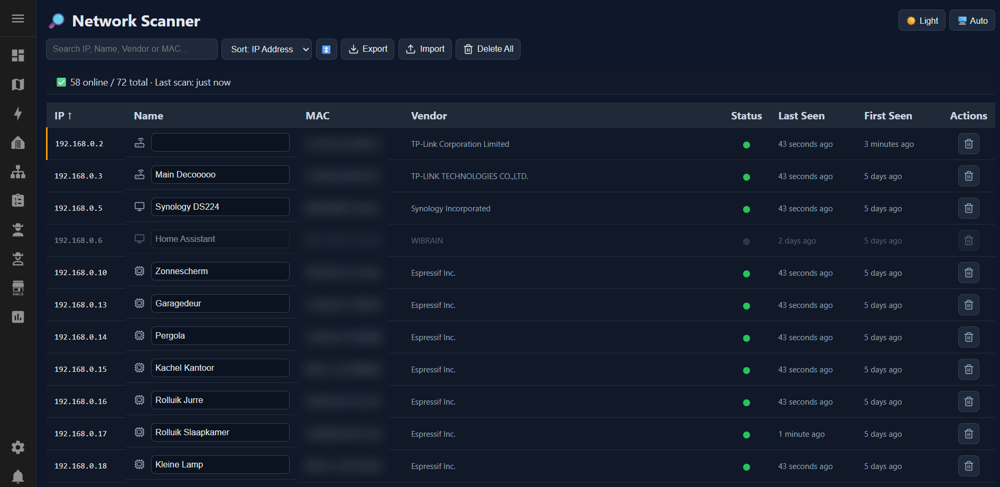

## Network Scanner

Lightweight Home Assistant add-on for discovering and tracking devices on your local network.
Network Scanner combines periodic ARP scanning with passive mDNS listening for ESPHome devices, providing a fast and reliable overview of active devices on your network.

Sure, you could use your router's client page or an app on your phone. But this is pretty convenient.

### Screenshot



### Features

- 🔎 Periodic ARP network scanning
- 📡 Passive mDNS listener for ESPHome devices
- 💾 Persistent storage of discovered devices
- ✏️ Editable device names
- 🆕 Mark devices as “known” simply by naming them
- 🔔 Home Assistant event when a new device is detected
- 🔍 Fast search and filtering
- ↕️ Sorting by IP address, name, first seen, and last seen
- 📤 Export device database to JSON backup
- 📥 Import backups
- 🌙 Dark mode with automatic theme support
- ⚡ Background scanning for responsive UI
- 🧹 Delete individual devices or clear scan history

### Why rename devices?

Unnamed devices are considered “new” devices.

Assigning a custom name to a device is the way to acknowledge and permanently recognize devices on your network.

Example:

- `192.168.0.45` → appears as new
- Rename to `Living Room ESP32`
- Device is now treated as known and easier to track

This makes it very easy to maintain an overview of trusted devices over time.

### How it works

#### ARP Scanning

The add-on periodically scans the configured IP range using ARP requests to detect active devices on the network.

#### mDNS Listener

In parallel, a passive mDNS listener listens for network announcements from ESPHome and other multicast-enabled devices.
This allows devices to appear even between scan intervals.

#### Persistent Storage

Discovered devices and custom names are stored locally so they survive restarts and updates.

#### Home Assistant Events

When the scanner discovers a device that has not been seen before, the add-on fires a Home Assistant event.

Event type:

```text
network_scanner_new_device_detected
```

Example event data:

```json
{
  "mac": "aa:bb:cc:dd:ee:ff",
  "ip": "192.168.0.45",
  "seen_at": "2026-06-07T12:39:32.267655+00:00",
  "source": "network_scanner"
}
```

This can be used to create automations, notifications, logging, or alerts when an unknown device appears on your network.

You can also listen for the event manually in Home Assistant:

1. Open **Developer Tools**
2. Go to **Events**
3. Listen to:

```text
network_scanner_new_device_detected
```

4. Add a new device to your network or clear a known device from storage to test the event.

### Configuration

IP range and scan interval are configurable.

Example configuration:

```yaml
target_ip: "192.168.0.0/24"
scan_interval: 30
```

| Option | Description |
|---|---|
| `target_ip` | Target subnet to scan |
| `scan_interval` | Scan interval in seconds |

### Import and export

Network Scanner can export its stored device information to a JSON backup file and import that file again later.

This is useful for:

- reinstalling the add-on
- moving to a fresh Home Assistant installation
- keeping a backup of named devices
- restoring known-device state after testing

### Privacy

All scanning is performed locally inside your Home Assistant environment.

No cloud services are used.
No external telemetry is collected.
